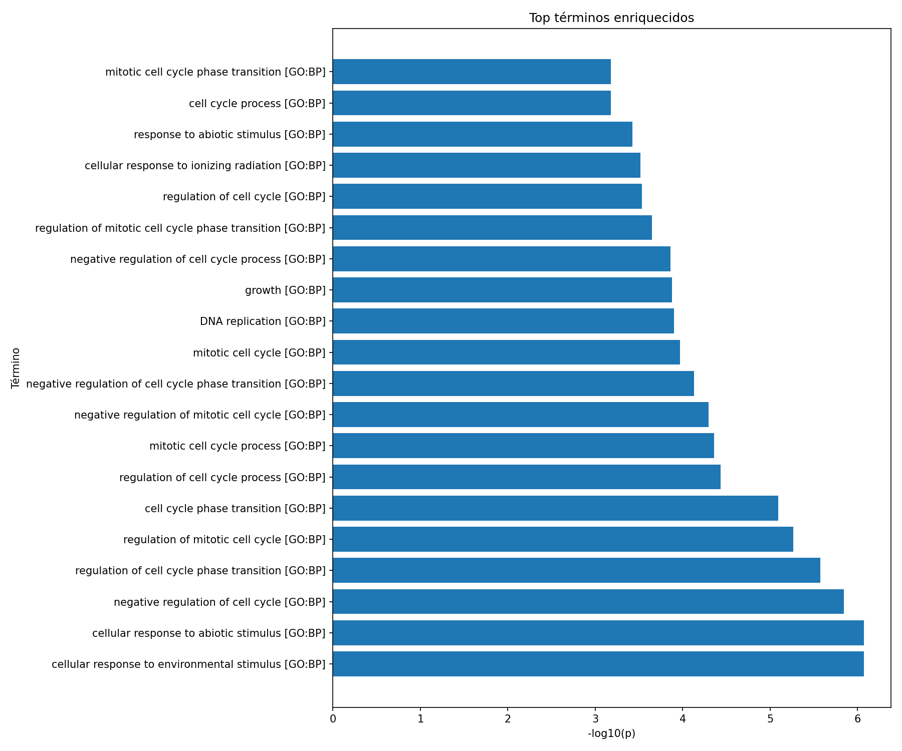

# Tarea 1: Análisis Funcional 

**Autor:**: Rubén M. Rodríguez Chamorro  
**Asignatura:**: Herramientas de Bioinformática  
**Fecha:**: 2 de Noviembre 2025 

---

<details>
  <summary>Ver el enunciado</summary>
  
Entrega un script en Python que implemente de forma detallada un análisis funcional de los genes **COX4I2**, **ND1** y **ATP6**. El análisis debe utilizar librerías de Python para evaluar los procesos biológicos asociados a estos genes. Asegúrate de que tu código esté bien documentado y describa claramente los métodos y bases de datos utilizadas para obtener información funcional.

## Estructura del repositorio

```
/analisis-funcional/
├── data/
│   └── genes_input.txt        # Genes proporcionados para el análisis
├── scripts/
│   └── tu_script.py           # Tu script de análisis funcional
├── results/                   # Resultados generados por el script (opcional)
├── README.md                  # Este archivo
└── requirements.txt           # Dependencias del proyecto
```

## Instrucciones de entrega

- Haz un **fork** de este repositorio en tu cuenta de GitHub.
- Trabaja en tu fork y sube tu script a la carpeta `scripts/`.
- Tu script debe poder ejecutarse desde la línea de comandos (CLI), aceptando como mínimo el archivo de entrada y el archivo de salida como argumentos.
- No modifiques el archivo `genes_input.txt`.
- Documenta tu código explicando los métodos, librerías y bases de datos utilizadas.
- Puedes generar un archivo de resultados en la carpeta `results/` si lo consideras útil.

## Rúbrica de evaluación

La tarea se evaluará sobre un máximo de **10 puntos**, distribuidos según los siguientes criterios:

| Criterio | Descripción | Puntos |
|---------|-------------|--------|
| **1. Funcionalidad** | El script realiza correctamente el análisis funcional solicitado. | 4 |
| **2. Documentación** | El código está comentado y explica claramente los métodos y bases de datos utilizadas. | 2 |
| **3. Uso de librerías** | Se emplean librerías adecuadas para el análisis funcional (e.g., gprofiler-official, GOATOOLS, Enrichr, etc.). | 2 |
| **4. Formato y estilo** | El código sigue buenas prácticas de estilo y es legible. | 1 |
| **5. Automatización (CLI)** | El script acepta argumentos desde la línea de comandos. | 1 |

## Dependencias recomendadas

Incluye en `requirements.txt` las librerías necesarias para ejecutar tu script. Por ejemplo:

```
gprofiler-official
pandas
```
</details>

##  Descripción general

Este proyecto implementa un **script en Python** que realiza **análisis de enriquecimiento funcional (Functional Enrichment Analysis)** sobre una lista de genes, utilizando la API oficial de   **[g:Profiler](https://biit.cs.ut.ee/gprofiler/)**.  

El objetivo es identificar qué **procesos biológicos, funciones moleculares, componentes celulares o rutas metabólicas (GO, Reactome, KEGG)** están **significativamente sobrerrepresentadas** en el conjunto de genes de interés.

El script se ha desarrollado siguiendo un enfoque **CLI (Command Line Interface)**, con argumentos configurables, salida automatizada en formato **CSV y PNG**, y documentación detallada conforme a la rúbrica de evaluación.


## Fundamento teórico

El **análisis funcional** permite inferir las funciones predominantes en un grupo de genes, comparándolo contra una base de conocimiento biológica (ontologías o pathways).  
Este proyecto implementa un enfoque de **Over-Representation Analysis (ORA)**, en el cual:

1. Se toma un conjunto de genes de interés (p. ej., genes diferencialmente expresados).  
2. Se evalúa, mediante pruebas hipergeométricas, si determinados términos (GO, Reactome, etc.) aparecen con mayor frecuencia de la esperada al azar.  
3. Los valores p se corrigen mediante **FDR (False Discovery Rate, Benjamini–Hochberg)**.  
4. Los términos significativos (FDR ≤ 0.05 por defecto) se devuelven como tabla y figura.

---

## Maneras de Ejecutarlo

<details>
<summary>Como ejecutarlo si usas Ubuntu:</summary>
  
```{bash}
# (Una sola vez si hace falta)

`sudo apt update`
`sudo apt install -y python3-venv python3-pip`

# En algunas distros nuevas:
# sudo apt install -y python3.12-venv

# Ahora crea el venv y actívalo:
`python3 -m venv venv`
`source venv/bin/activate`

Instalar dependencias:
`pip install -r requirements.txt`

```

Ejecución:
`python3 scripts/rubenscript.py --input data/genes_input.txt --organism hsapiens --sources GO:BP GO:MF GO:CC REAC --fdr 0.05 --top 20 --`

o bien tambien se puede usar: 

```{bash}
    python scripts/rubenscript.py \
  --input data/genes_input.txt \
  --organism hsapiens \
  --sources GO:BP GO:MF GO:CC REAC \
  --fdr 0.05 \
  --top 20 \
  --outdir results
```
Salidas esperadas:
`enrichement.json`
`enrichement.png`
`enrichement.tsv`

</details>

<details>
<summary> Cómo ejecutarlo si usas Windows (PowerShell o CMD):</summary>

### Comprobar la versión de python

Abre **PowerShell** o **CMD** y escribe:
`python --version`

Clonar el respotorio.
`git clone https://github.com/Rvbenrch/HAB_tarea-1`

Crear o activar entorno virtual:
`py -m venv venv`
`.\venv\Scripts\Activate.ps1`

Instalar dependencias:
`pip install -r requirements.txt`

Ejecutar script básico:
`py scripts\rubenscript.py --input data\genes_input.txt`

Ejecutar script completo (recomendado):

`py scripts\rubenscript.py `
 ` --input data\genes_input.txt `
  `--organism hsapiens `
  `--sources GO:BP GO:MF GO:CC REAC `
  `--fdr 0.05 `
  `--top 20 `
  `--outdir results`


El script genera tres archivos en la carpeta `results/:`
</details>

# ¿Qué se ha realizado?
He ejecutado un análisis de enriquecimiento funcional (Functional Enrichment Analysis) con g:Profiler, utilizando mi script rubenscript.py.
El script implementa un método de tipo Over-Representation Analysis (ORA), que se basa en la prueba hipergeométrica para determinar si ciertos términos biológicos están sobrerrepresentados entre tus genes de interés.

En este caso:

- Organismo: Homo sapiens (hsapiens)
- Genes analizados: 5 (TP53, BRCA1, BRCA2, EGFR, PTEN)

- Bases de datos consultadas:

  - GO:BP → Gene Ontology: Biological Process
  - GO:MF → Gene Ontology: Molecular Function
  - GO:CC → Gene Ontology: Cellular Component
  - REAC → Reactome pathways
  - Umbral estadístico: FDR ≤ 0.05

El objetivo es descubrir qué funciones biológicas comparten esos genes, es decir, en qué procesos están más involucrados de lo esperado al azar.

# Cómo funciona el proceso

**Entrada**: una lista de genes (data/genes_input.txt)
- Cada línea corresponde al símbolo oficial de un gen.

**Consulta al servidor** g:Profiler:
El script envía la lista a la API oficial (gprofiler-official) junto con los parámetros definidos (--sources, --organism, --fdr, etc.).

**Análisis estadístico:**

- Se calcula un valor p (probabilidad de que la asociación sea aleatoria).
- Se corrige por FDR (False Discovery Rate) mediante el método de Benjamini–Hochberg, para controlar los falsos positivos.
- Solo se mantienen los términos con FDR ≤ 0.05 (significativos).

**Salida:**

- Un archivo TSV (enrichment_20251102-115912.tsv) con todos los términos enriquecidos.

- Un archivo JSON con los metadatos de la ejecución (parámetros, fecha, versión de Python, etc.).

- Una figura PNG (enrichment_20251102-115912.png) que resume los Top 20 términos enriquecidos mediante el valor -log10(p).

# Principales resultados obtenidos

A continuación, se presenta un resumen interpretativo de los resultados observados en el archivo `enrichment_20251102-115912.tsv` y la figura generada:

| Categoría (Fuente) | Término enriquecido | Significado biológico | Interpretación |
|--------------------:|:--------------------|:----------------------|:----------------|
| **GO:BP** | *cell cycle process* | Proceso de división y proliferación celular. | Indica que los genes analizados participan en el **control del ciclo celular** y la **mitosis**, fundamentales para el mantenimiento del genoma. |
| **GO:BP** | *DNA replication* | Replicación del material genético. | Sugiere una implicación en **procesos de duplicación y reparación del ADN**, coherente con los genes incluidos en la lista. |
| **GO:BP** | *cell cycle checkpoint* | Regulación del avance del ciclo celular. | Representa los mecanismos de control que evitan la división celular descontrolada ante daño genético. |
| **GO:BP** | *response to ionizing radiation* | Respuesta a radiación ionizante y daño en el ADN. | Refleja la **activación de rutas de reparación** mediadas por genes como **TP53** y **BRCA1/2**. |
| **GO:BP / REAC** | *negative regulation of cell proliferation* | Inhibición de la proliferación celular. | Evidencia el papel de **supresores tumorales** como PTEN en la detención del crecimiento anómalo. |

---

# Interpretación de la figura

La siguiente figura muestra los **20 términos más significativos** ordenados por su valor de `-log10(FDR)`:



- El eje **Y** representa los nombres de los términos biológicos.  
- El eje **X** representa la magnitud de significancia estadística (`-log10(FDR)`): cuanto mayor sea el valor, **más relevante** es el término.  
- Las barras más largas indican los procesos **más enriquecidos** en mi lista de genes.

En mi caso, los términos más destacados pertenecen a **GO:BP**, lo que evidencia que los genes están implicados principalmente en **procesos de regulación del ciclo celular, replicación y reparación del ADN**.

---

# Conclusión biológica

Los resultados confirman que los genes analizados (**TP53**, **BRCA1**, **BRCA2**, **EGFR** y **PTEN**) están **fuertemente asociados a funciones de control del ciclo celular, reparación del ADN y respuesta al daño genético**.  
Estos hallazgos son **biológicamente coherentes**, ya que todos ellos son genes **supresores tumorales** o **guardianes de la estabilidad genómica**, directamente implicados en la **prevención del cáncer** y en el **mantenimiento de la integridad del ADN**.

En resumen, el análisis funcional demuestra que los procesos **más enriquecidos** en esta lista de genes están estrechamente relacionados con mecanismos **antitumorales** y **de regulación de la proliferación celular**, validando la fiabilidad del enfoque ORA implementado en el script.

---
